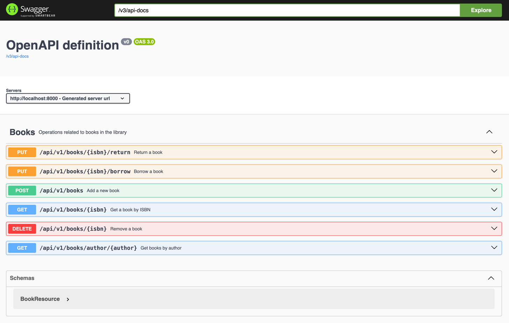

# Library Management System

## Running The Application

### Prerequisites
- Java 21

### Steps to Run the Application

1. **Clone the repository:**
   ```sh
   git clone https://github.com/muhammad-abdurrahman/library-management-system.git
   cd library-management-system
    ```

2. **Build the project:**
   ```sh
   mvn clean install
   ```
3. **Run the application:**
   ```sh
   mvn spring-boot:run
   ```
4. **Access the application:**
- The application will be running at http://localhost:8000.

### Running Tests
- To run the tests, execute the following command:
   ```sh
   mvn test
   ```
## API Documentation
- The API documentation can be accessed at http://localhost:8000/swagger-ui.html



**Endpoints**
1. ***Add a Book***
    - *URL*: `/api/v1/books`
    - *Method*: `POST`
    - *Request Body*:
   ```json
   {
   "isbn": "string",
   "title": "string",
   "author": "string",
   "publicationYear": 2023,
   "availableCopies": 5
   }
   ```
    - *Response*:
        - *201 Created*: Book added successfully.
        - *409 Conflict*: Book already exists.
---
2. ***Find Book by ISBN***
    - *URL*: `/api/v1/books/{isbn}`
    - *Method*: `GET`
    - *Response Body*:
   ```json
   {
   "isbn": "string",
   "title": "string",
   "author": "string",
   "publicationYear": 2023,
   "availableCopies": 5
   }
    ```
    - *Response Status*:
        - *200 OK*: Book found.
        - *404 Not Found*: Book not found.
---
3. ***Find Books by Author***
    - *URL*: `/api/v1/books/author/{author}`
    - *Method*: `GET`
    - *Response Body*:
   ```json
   [
   {
   "isbn": "string",
   "title": "string",
   "author": "string",
   "publicationYear": 2023,
   "availableCopies": 5
   }
   ]
    ```
    - *Response Status*:
        - *200 OK*: Books found.
        - *404 Not Found*: No books found for the given author.
---
4. ***Borrow a Book***
    - *URL*: `/api/v1/books/{isbn}/borrow`
    - *Method*: `PUT`
    - *Response*:
        - *200 OK*: Book borrowed successfully.
        - *404 Not Found*: Book not found.
        - *409 Conflict*: No available copies.
---
5. ***Return a Book***
    - *URL*: `/api/v1/books/{isbn}/return`
    - *Method*: `PUT`
    - *Response*:
        - *200 OK*: Book returned successfully.
        - *404 Not Found*: Book not found.
---
6. ***Remove a Book***
    - *URL*: `/api/v1/books/{isbn}`
    - *Method*: `DELETE`
    - *Response*:
        - *200 OK*: Book removed successfully.
        - *404 Not Found*: Book not found.

## Assumptions and Design Decisions
- *Concurrency*: An assumption has been made that this service will not be scaled out horizontally so a local locking approach has been taken where possible using [ReentrantLock](https://docs.oracle.com/en/java/javase/21/docs/api/java.base/java/util/concurrent/locks/ReentrantLock.html). This approach is not suitable for distributed systems and would need to be replaced with a distributed locking mechanism like [Redisson](https://redisson.org/) or [Zookeeper](https://zookeeper.apache.org/) for a distributed system.
- *Mandatory Fields*: All fields in the `BookResource` class are mandatory.
- *Cache Usage*: The cache is used primarily for read operations to improve performance. Write operations like borrowing a book interact directly with the database to ensure data consistency.
- *Rate Limiting*: Implemented using the `Token Bucket Algorithm` to prevent abuse of the API. The rate limit is set to 60 requests per minute per client.
- *Integration Tests*: In the integration tests, I have included the `@DirtiesContext` annotation to reload the application context after each test method. This approach was chosen for simplicity in this context. However, in production code, I would avoid using this annotation and instead ensure each test is responsible for isolating its state, as well as managing its own setup and cleanup processes.

## Additional Features and Optimizations
- *Caching*: Used to improve performance for read operations. Cached books have a default `ttl` of 2 seconds and are refreshed on every read operation. Also added a cache eviction scheduler to remove stale data every minute (this can be configured via configuration to something more meaningful in production, depending on API usage).
- *Rate Limiting*: Implemented using [Bucket4j](https://github.com/bucket4j/bucket4j) to handle high traffic and prevent abuse.
- *[Swagger UI](https://swagger.io/)*: Added for easy API documentation and testing.
- *[H2](https://www.h2database.com/html/main.html) Database*: Used for development and testing purposes. Can be replaced with a more robust database like [PostgreSQL](https://www.postgresql.org/) for production.
- *Error Responses*: Used the `Problem Details` specification for standardised error responses. See: [RFC 7807](https://tools.ietf.org/html/rfc7807)
- *Business Domain*: Isolated the `Business` domain objects from the `Presentation` and `Persistence` layers to keep them protected and ensure separation of concerns. The objects from the other layers are mapped to/from the `Business` domain objects using [Mapstruct](https://mapstruct.org/) - a Java `bean` mapping framework.
- *Concurrency*: Used [ReentrantLock](https://docs.oracle.com/en/java/javase/21/docs/api/java.base/java/util/concurrent/locks/ReentrantLock.html) to handle concurrent requests for borrowing and returning books.
    - Chose [ReentrantLock](https://docs.oracle.com/en/java/javase/21/docs/api/java.base/java/util/concurrent/locks/ReentrantLock.html) over [StampedLock](https://docs.oracle.com/en/java/javase/21/docs/api/java.base/java/util/concurrent/locks/StampedLock.html) as it supports `fairness`, ensuring the longest waiting thread is prioritised for lock acquisition.
    - The locks were added at the book level so that multiple users can borrow/return different books concurrently.
    - Used `AOP` to handle the locking and unlocking of the book resources. This allowed for cleaner service methods and better separation of concerns.
